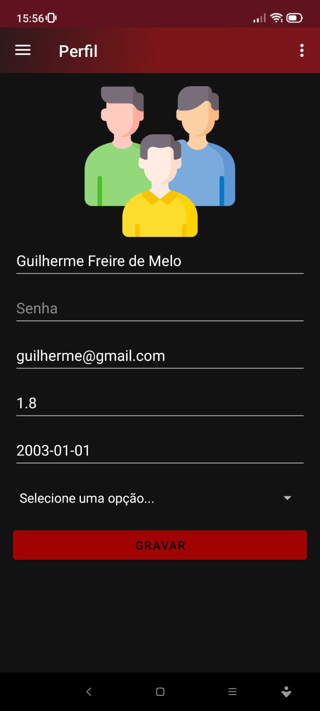
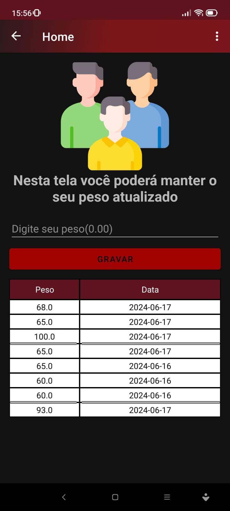
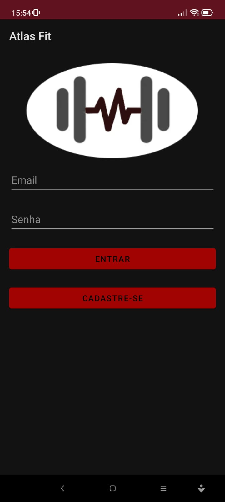
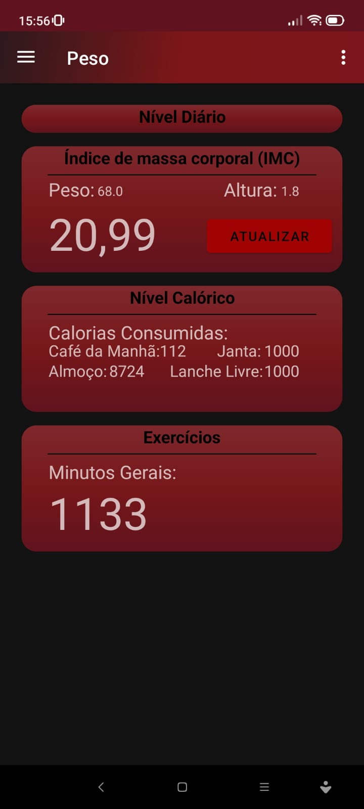

# App Fitness - Atlas Fit

Esse app visa pessoas que querem manter uma rotina de exercícios e controle de calorias. O app possui  comandos para registrar atividades (exercícios físicos), registros de alimentos informando quantas calorias o alimento possui, calcula o IMC da pessoa, controle de atividades. 
## Features

- **Log de Pesos:** Cadastro para atualizar o peso para o cálculo do IMC atualizado.
- **Módulo de Exercícios:** Fluxo de telas para buscar e cadastrar os exercícios.
- **Módulo de Refeições:** Fluxo de telas para buscar e cadastrar as refeições, com possibilidade de buscar as calorias dos alimentos.
- **Perfil:** Tela para manter os dados do usuário atualizados.

## Providers

- Buscar as calorias de cada refeição: https://caloriasporalimentoapi.herokuapp.com/api/calorias/
- Api do projeto[: https://caloriasporalimentoapi.herokuapp.com/api/calorias/](https://github.com/GuilhermeFM-20/projeto-sd)

## Screenshots

<table>
  <tr>
    <td> </td>
    <td> </td>
    <td> </td>
    <td> </td>
  </tr>
</table>

